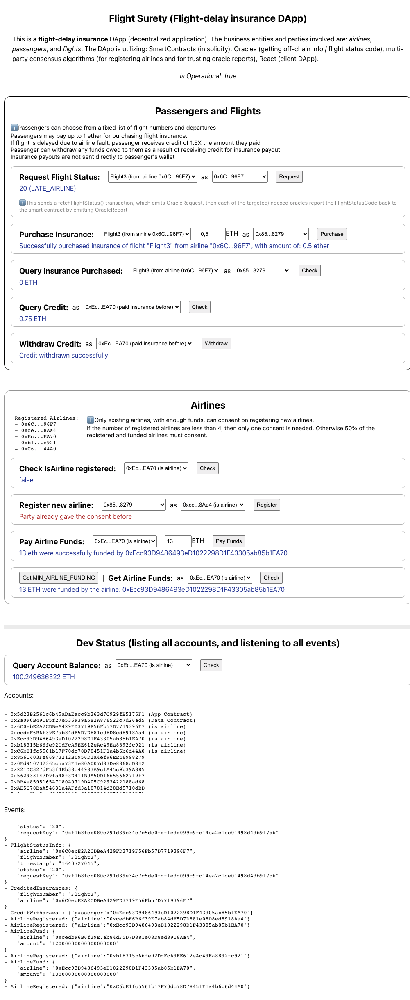

# Flight Surety: flight-delay insurace DApp

A sample decentralized application (DApp) project.

The DApp is utilizing: Smart Contracts (in solidity), Oracles (getting off-chain info / flight status code), multi-party consensus algorithms (for registering airlines and for trusting oracle reports), React (client DApp).

## Screenshot



## Install

Install [`truffle`](http://trufflesuite.com/docs/truffle/getting-started/installation) cli, Clone this repo, Then:

- `yarn install`
- `yarn setup` ... (runs `yarn install` in both `dapp/client/` and `dapp/server/`)
- `truffle compile`

## Development

Run local ethereum blockchain:

- `truffle develop` --then in repl--> `migrate --reset`

Start local dev servers:

- `yarn start` ... (starts `dapp/client/` and `dapp/server/`)

To view dapp client:

- `http://localhost:8000`

To run the tests:

- `truffle test`

## Deployment

To build dapp for prod:

- Update `truffle.js` to configure target network (Rinkeby, Kovan, Mainnet, …).
- `yarn install && yarn setup && truffle migrate --reset`
- `yarn build`
- Deploy the contents of the folders:
  - `dapp/client/build` the dapp (React)
  - `dapp/server/build` the oracles (or its simulation)

## Versions

`truffle version`

- Truffle v5.4.26 (core: 5.4.26)
- Solidity - ^0.8.11 (solc-js)
- Node v14.18.2
- Web3.js v1.5.3

---

## ToDo's & dev notes

<details>
<summary>Expand/Collapse</summary>

Rubrics: https://review.udacity.com/#!/rubrics/3609/view

- [x] Separation of Concerns, Operational Control and “Fail Fast”
  - [x] FlightSuretyData.sol for data persistence
  - [x] FlightSuretyApp.sol for app logic and oracles code
  - [x] Passenger can purchase insurance for flight
  - [x] DAPP Triggers contract to request flight status update
  - [x] A server app has been created for simulating oracle behavior. Server can be launched with “npm run server”
  - [x] operational status control implemented
  - [x] Contract functions “fail fast” by having a majority of “require()” calls at the beginning of function body
- [x] Airlines (Demonstrated either with Truffle test or by making call from client Dapp)
      First airline is registered when contract is deployed
  - [x] Only existing airline may register a new airline until there are at least four airlines registered
  - [x] Registration of fifth and subsequent airlines requires multi-party consensus of 50% of registered airlines
  - [x] Airline can be registered, but does not participate in contract until it submits funding of 10 ether (make sure it is not 10 wei)
- [x] Passengers
  - [x] Passengers can choose from a fixed list of flight numbers and departures that are defined in the Dapp client
  - [x] Your UI implementation should include:
    - [x] ~ Fields for Airline Address and Airline Name
    - [x] Amount of funds to send/which airline to send to
    - [x] Ability to purchase flight insurance for no more than 1 ether
  - [x] Passengers may pay up to 1 ether for purchasing flight insurance
  - [x] If flight is delayed due to airline fault, passenger receives credit of 1.5X the amount they paid
  - [x] Passenger can withdraw any funds owed to them as a result of receiving credit for insurance payout (Insurance payouts are not sent directly to passenger’s wallet)
- [x] Oracles (Server App)
  - [x] Oracle functionality is implemented in the server app
  - [x] Upon startup, 20+ oracles are registered and their assigned indexes are persisted in memory
  - [x] Update flight status requests from client Dapp result in OracleRequest event emitted by Smart Contract that is captured by server (displays on console and handled in code)
    - [x] Display nicely in console
  - [x] Server will loop through all registered oracles, identify those oracles for which the OracleRequest event applies, and respond by calling into FlightSuretyApp contract with random status code of Unknown (0), On Time (10) or Late Airline (20), Late Weather (30), Late Technical (40), or Late Other (50)

```
Accounts:
(0) 0x6c0ebe2a2cdbea429fd3719f56fb57d7719396f7
(1) 0xcedbf6b6f39e7ab84df5d7d881e08d8ed8918aa4
(2) 0xecc93d9486493ed1022298d1f43305ab85b1ea70
(3) 0xb18315b66fe92ddfca9ee612eac49ea8892fc921
(4) 0xc6be1fc5561b17f70dc78d78451f1a4b6b6d44a0
(5) 0x856c403fe86973212b0956d1a4ef96ee46998279
(6) 0x0ed950732365c5a73f1e80a007d83de8868cd842
(7) 0x221dc327df53f4eb38c44983a9c1a45c9b39a885
(8) 0x562933147d9fa48f3d411b0a50d16655662719f7
(9) 0xbb4e8595165a7d80a0719d405c9293422188ad68
(10) 0xae5c78baa54631a4affd3a187814d28ed5710dbd
(11) 0x3eccfbc8aad6d993a41ec1393889fe5142189b7b
(12) 0xb37b5cd3773651d723a60c00e7a4ee31bd0e2cca
(13) 0x49075b6bd16f93c9b9d639e492631f5121232078
(14) 0xbbba7fd5edc6f2d572521dc5cbc4ac8c45cdc85c
(15) 0x20c2feb389204e52f0a3e67ef58e56d77b8888c2
(16) 0xcd383c29f1fa94f430d8fffaad0829540fe2fad7
(17) 0xf4c724a1bc594bb634c4f9ce73f5f54dc1e17af2
(18) 0xea6c94987472b2be715f3521cb36fd76ac65a8d1
(19) 0x4d8c2e2d653140339575ed83677a6ff7615944e7
(20) 0xf6865c7f32dd2cad8926617c8b03b0694b131bd7
(21) 0x472bc8dcbc6e98a0fadd5f6eb3d696d3546eb29e
(22) 0xabc905d85883ea9a850b9ffb93a3303c1adf23bd
(23) 0xb4efc1d193e2374848a3215fb0d494ec0f2148ba
(24) 0x09b32754dae8f249b3dd8146d7a992aabb875f07
(25) 0x057215a976cf91fc4c9f9cffe2e20947a3b68660
(26) 0x61e57efa68bd24c0134240247d26c36125380e98
(27) 0x3eeee3df65801c1e2e066497ea96e34125a55741
(28) 0x283bbe7817ab5a0612b1726b01e54b0ab7a172a9
(29) 0x3301cdf79a69b47bd3bec2f2d2983c1341c1f84e
(30) 0x29341c7f4a5e7a01ad565af00facc7d45128542f
(31) 0x2211d20b6284a2e31510b01c62ebfe4ded585243
(32) 0x467829a222351dde5abaaa63f179c6b6b2727692
(33) 0x603e65a6609edd58f2dfcba67997cff478fc0c29
(34) 0x3d4ec5cc6a52bb16335f506f58e3d72b8b735ef9
(35) 0xf98425e9406dfae74db24323d736ab5a491c3aca

Private Keys:
(0) 3cc0e244320ddaf8e75599658cc45c661f018f5f6be11041b437003ace718ffb
(1) 230a67b5af837196cb1ee09d269c4f951f40528b6427016d3f5e3df1e9518055
(2) 8696706a4c9bd0e5afd4cbe514f804458d5901018ea2dad7e133d7bc80edbf12
(3) eec853c17c4d1c3ccbac5f66888d8e44aec8f04af52295fb193b150f18b486f9
(4) 68ea4a079c866ea7faca04c4a9d94e6d99cc88ac223191301562f27eb9408f69
(5) 4f2aff774e13d9f1ad84fb8f5556df45be986cd42d9b81a7d4db8f2297c562b4
(6) b1cb456b379df1987c7cbcd9cf10017ac131fe09b3b966bb80e6be93c75f20d9
(7) 3bf3814d786c313c146670170a37be202ee901035597bd9d590675691bb45df7
(8) 8ac80df52d0454e65be245118f18d252312baa56e3ec0621b004b78395853033
(9) 43a99baa8e8247c448140472c1b7b70f3b115f84fb7b20a7b654016cdaa581c1
(10) 0992962f3869e028db50dd0cee1d81720b610ef4b7d4cff2173f65dd6ba0caca
(11) 26e33102774f8636e412f29101aba17f060aeb59cb08d5ddb61e3df4d7fe2dff
(12) fab49113b144835f6456eb8af88ed45540e9f16ce144d9a300246b7fd619e2aa
(13) 70f858f0db3ff0cbe6cbd611107faa1aa33aa7c4b2f621c1ba23b98e52f6b4d4
(14) 91af45fe7d1c3f3df0472b78f6ee9de2fc0811b226d0e01e0c44a7472757e2d2
(15) b4d5df65a13d81693d817cb943a59764a6569c2745db5ccd33ee77845df99a85
(16) 7d9fda618f8efc7c496807038c4b5bc5edbd88cdab3355079dbba6e6327fae3f
(17) ea21c39ed169fce55300defc03362f31a8cacb53d2f99c6d13ebb088fb656084
(18) cd77d84fcb53e564fb8916d522abe9cc95cf2d069a296ce0e581933d94a52b08
(19) 46149dee33ac096df9bd4d4ffeec597c4c73e13223e874c1cbc73bab8fe8e509
(20) 63a3588083493ea1986ad2d70c15b0fdc1d44be306349e07a3905f0a80c67cea
(21) 5db8ed4d9a7241ff340e0e22163042f998f7d499f0f4e0d5f83f14d0f94fa046
(22) 40b611385ec0f5cc21dfb2d8d81dc3dec33c4a38b920f64c474dd3e6a9149e40
(23) b8fd125efd8fa9d9c78edfd7d9b986bbc3914f755580b34f2c4147fc59dea01c
(24) b54b0c27e1285bd6fdfa69dd881fb94c6b95d5abd0e9be890a742ba9448ba968
(25) 14b39f02ec85045c3028821d6ca8860b88f87c2702a611314d7dbec2ae4ec27b
(26) db0641a9a8969458cab9ee098118abfec773c674471615e3d081bdc908a93a1e
(27) a7aeaba2675e393484108c91efef153ee19ebb7346d8b2cd1ed6cea2e2bd5250
(28) 88453afdb69e0fc34481160b888ca9f18e4137a552ac1464e23662dfe679b442
(29) e36a16047a7e6af49fab32f80c5a8d8059c8fb40d75579c55aafdeacb7284ee4
(30) d30fa1696f803e5007f81f12542e0083a19afbb527c3b7a1d6a568a7d268fed5
(31) 2cbd3b0c120670fa9c2383e7c0fbbe19c00fea4ffd36a55366a5d9aa4deefd08
(32) 328ea546c3044b9c9eef5dd5ab37f7cd4a2da326ab59c837693334ae3fde8a9e
(33) cbaff751d505029028bd0baa359d32b913b72b4c42dfd96d095c95c13901280d
(34) e3153fe8ba688bb6ef0e25f7099322557f506c00f6f5df13a5760c4b4550842d
(35) 81c4cba8837a9ba2a8c5a7ab5a9844120690356be213face19db6753519fec67
```

</details>

---

## Resources

- [Blockchain Developer Nanodegree Program](https://udacity.com/course/nd1309)
- [Solidity Language Docs](https://docs.soliditylang.org)
- [web3.js Docs](https://web3js.readthedocs.io)
- [Truffle framework](http://trufflesuite.com)
- [Remix.Ethereum.org](https://remix.ethereum.org)
- [EIP specs: ERC20 (Token), ERC721 (Non-Fungible Token), …](https://eips.ethereum.org/erc)
- [Spin-from/parent repo](https://github.com/hossam-magdy/web3/tree/9150752/L5.Project-FlightSurety)
- [Project's Starter Code](https://github.com/udacity/FlightSurety/tree/28a78bc)

More … from reviewer:
- https://mycoralhealth.medium.com/advanced-blockchain-concepts-for-beginners-32887202afad
- https://ethereum-magicians.org/t/dapplets-rethinking-dapp-architecture-for-better-adoption-and-security/2799
- https://medium.com/@ChrisLundkvist/exploring-simpler-ethereum-multisig-contracts-b71020c19037
- https://codeburst.io/deep-dive-into-ethereum-logs-a8d2047c7371
- https://medium.com/3-min-blockchain/understanding-uint-overflows-and-underflows-solidity-ethereum-8603339259e6
- https://medium.com/experiencebihar/test-driven-development-tdd-in-blockchain-using-truffle-1f34c8bd69b7
- https://github.com/b-mueller/mythril/
- https://provable.xyz/
- https://medium.com/decentlabs/building-your-first-ethereum-oracle-1ab4cccf0b31
